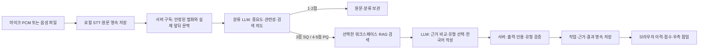

# STT 회의 도우미

2026-09-18 업데이트: 실시간·파일 STT에 서버 영속 구독과 중요도 1~5점 분류, Priority/Sub Queue를 적용했다. 관리자 사용법과 현재 한계·검증 결과는 [구현 문서](meeting-priority-implementation.md), 요구사항과 설계도는 [설계 문서](meeting-priority-design.md)를 참고한다.

## 처리 흐름



STT와 RAG는 각각의 Python 환경과 서비스로 유지한다. 브라우저는 기존 STT 인증으로 같은 origin의 `/api/stt/meeting`에서 서버 구독을 설정하고 작업 결과를 조회한다. STT 서버가 저장된 원문을 `http://127.0.0.1:8766`의 RAG API로 전달한다. 음성 패키지는 RAG 환경에 추가하지 않는다. 환경 프록시와 HTTP 리다이렉트를 통한 인증키 전달은 차단한다.

회의 도우미는 기본 꺼짐이다. RAG의 전역 AI 활성화, 연결 설정, 선택된 워크스페이스의 현재 공급자 전송 설정을 확인하며, 작업 단계에서 다시 검사한다. 낮은 점수는 분류만 수행하고 3점 이상이면 검색·생성을 이어간다. STT 자체는 도우미의 응답을 기다리지 않는다. 한 번 시작한 구독은 탭을 닫아도 서버에서 계속된다.

## API

- `GET /api/stt/meeting/workspaces`: RAG 워크스페이스 목록.
- `GET /api/stt/meeting/diagnostics`: RAG 모델·AI 연결·정책 상태.
- `GET /api/stt/meeting/config`: 선택적인 RAG 웹 링크.
- `PUT/GET /api/stt/meeting/sessions/{sid}/subscription`: 서버 분석 구독 시작·종료·조회.
- `GET /api/stt/meeting/sessions/{sid}/jobs`: 점수·큐·결과·페이지 단위 이력 조회.
- `POST /api/stt/meeting/sessions/{sid}/jobs/{jid}/retry`: 실패한 작업 재시도.
- `GET/PUT /api/rag/workspaces/{wid}/meeting/policy`: 관리자 정책 조회·변경.
- `POST /api/rag/workspaces/{wid}/meeting/jobs`: 영속 작업 접수.
- `POST /api/stt/meeting/workspaces/{wid}/analyze`와 `POST /api/rag/workspaces/{wid}/meeting/analyze`: 유지되는 기존 동기 분석 API.

서버 구독은 저장된 현재 발화와 실제 앞 3개·뒤 2개 문맥을 사용한다. 사용자 수정(`corrected`)도 안정된 발화로 처리한다. 원문과 문맥의 fingerprint, 세션 snapshot 세대, 작업 lease를 검증해 수정·철회·삭제된 발화의 오래된 결과가 다시 붙지 않게 한다. 동일한 원문이라도 분석에 사용한 문맥이 달라지면 재분류할 수 있다. 세션 소유권은 구독·조회·재시도마다 확인한다.

### 기존 동기 분석 API

다음 입력·팝업 예시는 호환성을 위해 유지한 `/meeting/analyze` 계약이다. 현재 자동 입력은 이 동기 호출을 브라우저에 줄 세우지 않고 서버 구독으로 처리한다.

입력 예시(합성 자료):

```json
{
  "session_id": "session_example",
  "utterance": {
    "utterance_id": "utt_example",
    "revision": 1,
    "text": "운영서버 로그 기록은 45일 동안 남아요.",
    "status": "stable",
    "speaker_id": "A",
    "start_ms": 12000,
    "end_ms": 15000
  },
  "context": [],
  "revision_id": null
}
```

동기 분석 응답은 `workspace_id`, `session_id`, `utterance_id`, `utterance_revision`, `revision_id`, `request_id`, `status`, `reason`, `analysis`, `popup`, `evidence`, `timings_ms`를 포함한다. 상태는 `popup`, `suppressed`(검색할 업무 내용 없음 등), `insufficient_evidence`, `unavailable`이다. 기존 STT 동기 연결부의 입력 발화는 4,000자, 문맥은 최대 3개×1,500자이며 요청 64KiB·응답 2MiB를 제한한다. 새 작업 접수는 발화당 최대 10,000자를 보관하고 별도의 문맥·전송 크기 제한과 페이지 조회를 사용한다.

팝업 객체 예시(합성 근거 ID):

```json
{
  "id": "popup_example",
  "kind": "warning",
  "color": "red",
  "title": "운영 로그 보관 기간 정정",
  "message": "운영서버 로그는 90일, 개발서버 로그는 30일 보관합니다.",
  "confidence": 0.96,
  "citations": ["revision.chunk"]
}
```

| kind | 서버가 지정하는 color | 의미와 판단 기준 |
| --- | --- | --- |
| warning | red | 같은 대상·환경·시점의 구체적인 주장이 문서와 충돌 |
| caution | orange | 접속·발급 등 실무 절차 안내 또는 조건·근거 충돌 확인 필요 |
| info | blue | 관련 배경·정책·참고 정보 |
| success | green | 같은 조건에서 구체적인 주장이 근거와 일치 |

색상은 자유 CSS가 아닌 이 대응으로 고정된다. 유형은 LLM이 선택한다. 빨강·초록은 근거 비교와 적용 범위가 명확할 때만 허용한다. 발화가 단순히 “서버”라고 하여 운영·개발을 구분할 수 없으면 각 조건을 안내한다. 두 문서가 서로 충돌하면 한쪽을 정답으로 확정하지 않는다. 제공된 근거 ID만 인용할 수 있고, 팝업은 근거를 반드시 포함한다. confidence는 LLM의 자기 평가이며 사실 정확도를 보장하는 확률이 아니다.

개인키 사례에서는 문서에 있는 보관 위치·발급 절차·담당자를 설명한다. 개인키 본문이나 토큰을 팝업에 출력하는 기능이 아니다. 발화와 문서 본문은 명령이 아닌 분석 데이터로 처리한다.

새 분류 프롬프트는 `prompts/meeting_classify.md`, 답변 작성은 `prompts/meeting_popup.md`에 있다. `prompts/meeting_extract.md`는 기존 동기 분석 경로에 남아 있다. 업무 범위와 모델·시간 정책은 관리자 화면에서 저장한다.

## 실행과 검증

```sh
uv sync --project rag --frozen
uv run --project rag pytest rag/tests -q
backend/.venv/bin/python -m pytest backend/tests -q
npm --prefix frontend test
npm --prefix frontend run build
backend/.venv/bin/python scripts/service.py restart
python3 scripts/rag.py restart
```

기본 연결은 `STT_RAG_BASE_URL=http://127.0.0.1:8766`이다. 다른 RAG 관리자 키를 쓰면 `STT_RAG_TOKEN_FILE`을 절대 경로로 설정한다. 웹 링크가 필요하면 `STT_RAG_PUBLIC_URL`을 공개 RAG origin으로 설정하거나 진단의 `public_origin`을 사용한다. 인증키를 URL에 넣지 않는다. 새 버전은 STT에 구독·전달 영수증 테이블을 추가하고, RAG schema 6에 정책·구독·영속 작업 테이블을 추가한다.

현재 버전의 자동 검증과 설치·실제 모델 검증 기록은 [구현 문서의 검증 항목](meeting-priority-implementation.md#6-자동-검증)을 기준으로 한다. 아래는 기존 동기 분석 기능을 확인한 과거 기록이며, 새 큐의 성능 측정 결과가 아니다.

### 2026-09-09 확인한 결과

- STT 전체 테스트 83개와 추가 문맥 변경 회귀 3개, RAG 전체 116개, 프런트엔드 29개 통과. Python Ruff와 프런트엔드 프로덕션 빌드 통과.
- 실제 `gpt-5.6-terra`와 로컬 E5로 합성 문서 6개 상황 검증: 빨강 정정, 주황 개인키 발급 안내, 초록 일치, 파랑 백업 정보, 근거 없는 질문, 잡담 모두 기대한 결과. 안정된 텍스트 입력 후 팝업 분석은 약 8.5~12.6초. [실제 LLM 결과](meeting-live-results.json).
- macOS Yuna 합성 음성 5.4초를 실제 STT WebSocket에 재생 속도로 공급했다. 실제 `large-v3-turbo`가 “운영 서버 로그 기록은 45일 동안 서버에 남아요.”를 인식했고, STT 연결부를 거친 실제 RAG/LLM이 운영 90일·개발 30일의 빨강 팝업을 생성했다. STT 처리 17.5초, 연결부 분석 9.7초, 준비 포함 전체 약 30초였다. 실제 마이크나 다인 회의 정확도 시험은 아니다. [음성부터 팝업까지 결과](meeting-stream-results.json).
- 합성 API 응답을 사용하는 headless Chrome에서 네 색상·키워드·출처·화자, 닫기, 발화 수정, 워크스페이스 전환, 승인 차단, 데스크톱 및 390px 모바일을 검증했다. [화면 검증 결과](meeting/ui-test-results.json).

두 실제 모델 검증은 새 임시 합성 워크스페이스만 사용했으며, 완료 후 해당 문서·세션·생성 음성을 삭제했다. 기존 업무 문서와 전역 AI 설정은 변경하지 않았다. 스크립트는 `scripts/meeting_smoke.py`, `scripts/meeting_stream_smoke.py`, `scripts/meeting_ui_smoke.mjs`에 있다.

## 현재 한계

- 마이크 입력은 기존 5분 한도다. 장시간 회의의 연속 녹음 지원은 별도 작업이다.
- 안정된 발화를 분류한 뒤 3점부터 검색·답변을 수행한다. N초는 완료 목표이며 외부 LLM의 완성 답변을 절대 보장하지 않는다. 독립 마감 감시가 초과 사실을 표시한다.
- 현재 자동 분석은 서버 영속 PQ/SQ를 사용한다. 이전 브라우저 단일 큐의 대기 8개 초과 생략 규칙은 적용하지 않는다. 탭을 닫아도 계속되며, 명시적으로 검토를 종료하면 아직 끝나지 않은 작업을 중단한다.
- 원문과 분류·완료 결과는 서버에 저장하며 다음 조회에서 복원한다. 이미 시작한 모델·벡터 연산은 물리적으로 즉시 선점할 수 없고, SQ는 단계 경계에서 멈춘다.
- SQ 완료는 PQ 유입이 가용 용량 아래로 줄어드는 조건에 의존한다. 단일 프로세스 복구, 초기 고정 시간 추정, 장기 주제 cache·의미 중복 통합·혼합 발화 분할의 미구현 범위는 [현재 구현의 한계](meeting-priority-implementation.md#7-명확한-한계와-남은-작업)에 정리했다.
- 문서 검색 품질·STT 오인식·LLM 추론 오류에 영향을 받는다. 구조·인용·조건 검증이 문장의 사실성 전체를 보장하지 않는다. 실제 정책은 연결한 문서에 있어야 한다.
