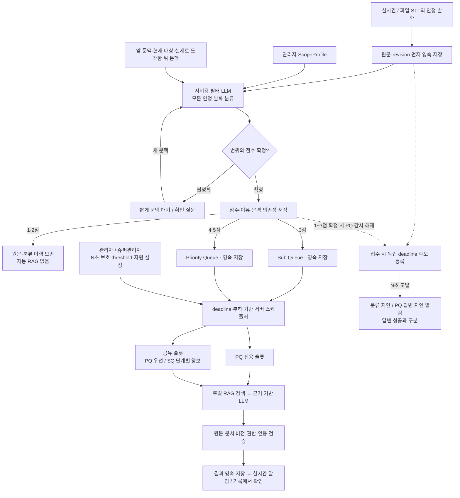
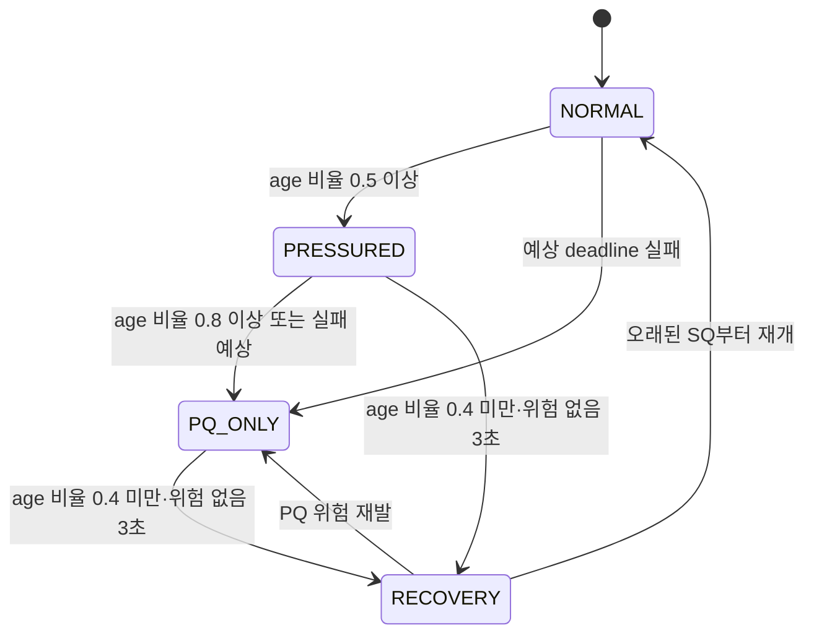
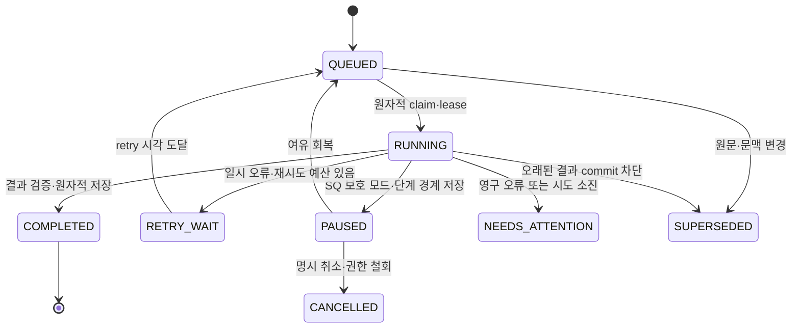
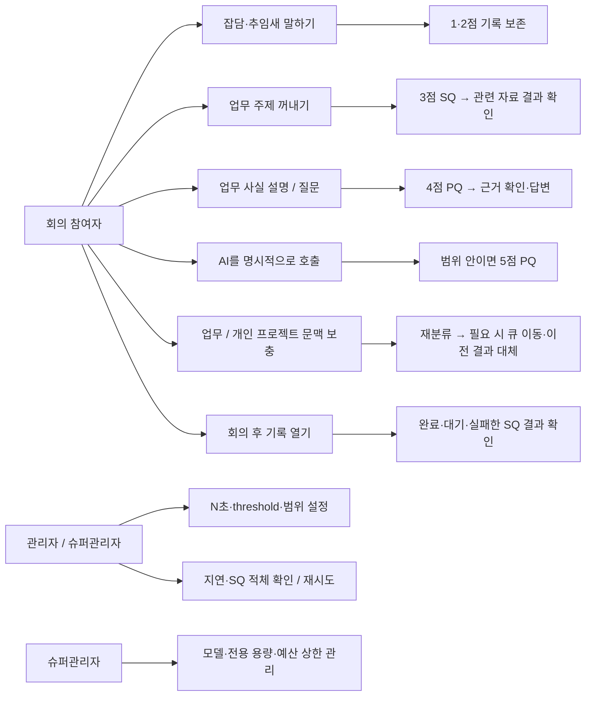
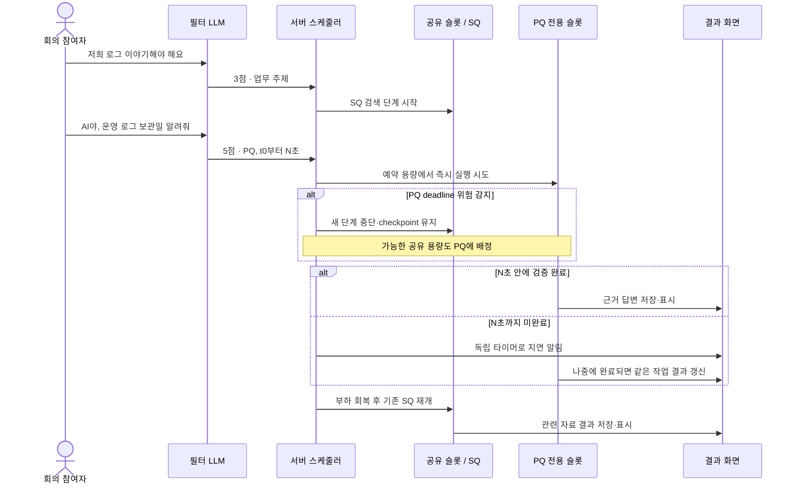

# 발화 분류와 Priority / Sub Queue 설계

설계 기준 · 2026-09-18 · 핵심 분류·서버 영속 PQ/SQ 구현 완료

현재 구현·관리자 사용법·검증 결과·한계는 [구현 문서](meeting-priority-implementation.md)를 기준으로 확인한다. 이 문서에는 장기 주제 상태, 의미 중복 통합, 혼합 발화 분할 등 아직 구현하지 않은 목표 설계도 포함되어 있다. 아래 설계도와 세부 제안을 모두 구현 완료로 해석하지 않는다.

이 문서는 모든 안정된 STT 발화를 저렴하고 빠른 LLM으로 분류하고, 4·5점은 Priority Queue(PQ), 3점은 Sub Queue(SQ)에서 처리하는 구조를 정의한다. 1·2점 원문과 분류 이력도 보존한다. 점수는 **현재 선택한 RAG에서 처리할 중요도**이며 사람의 발언 가치나 관계의 중요도를 뜻하지 않는다.

그림 바로 보기: [전체 설계도](meeting-priority-diagrams/architecture.svg) · [보호·복구 모드](meeting-priority-diagrams/scheduling-modes.svg) · [작업 생명주기](meeting-priority-diagrams/job-lifecycle.svg) · [사용자 Use Case](meeting-priority-diagrams/use-cases.svg) · [처리 순서 예시](meeting-priority-diagrams/sequence.svg). 같은 폴더에 PNG와 편집 가능한 Mermaid 원본도 포함했다.

## 1. 설계 결정

- 필터 LLM은 모든 안정된 논리 발화를 판단한다. `partial` 토큰 갱신마다 호출하지 않는다. “어”, “음”도 안정된 발화로 기록됐다면 분류 대상이다.
- 1·2점은 저장만 하고 자동 RAG 작업을 만들지 않는다. 3점은 SQ, 4·5점은 동일한 PQ에 넣는다.
- 점수와 처리 긴급도를 분리한다. 4점이 오래 기다려도 5점으로 바꾸지 않는다. 마감까지 남은 시간으로 실행 순서를 높인다.
- RAG 관련성은 **업무 대상·현재 문맥·워크스페이스 범위**로 판단한다. 키워드 일치나 검색 결과의 존재로 결정하지 않는다.
- 관리자와 슈퍼관리자가 N초를 설정한다. N은 분류·큐 대기·검색·생성·검증을 포함한 PQ 답변 목표시간이다.
- 외부 LLM을 포함하는 완성 답변의 절대 시간 보장은 불가능하다. N초 안의 완성 답변을 SLO로 관리하고, 기한에 답변이 없으면 별도 타이머가 지연 상태를 알린다. 이 알림은 답변 성공으로 집계하지 않는다.
- PQ 지연 위험이 커지면 SQ 신규 실행을 멈춘다. 실행 중 SQ는 단계 경계에서 일시정지하고, 이미 시작한 원격 LLM 호출의 즉시 중단은 전제하지 않는다.
- SQ는 영속 저장하고 회의 종료 뒤에도 처리한다. PQ가 영원히 용량을 초과하는 상황에서 SQ 완료까지 보장하려면 용량 확대나 유입 제한이 필요하다.

## 2. 현재 구현과 변경 범위

| 항목 | 변경 전 구현 | 설계 방향과 현재 적용 범위 |
|---|---|---|
| 자동 입력 | 마이크 세션에서 검토를 켠 경우 | 마이크와 파일 분석 모두 지원하되 파일은 점진적으로 접수 |
| 첫 LLM | 모든 안정된 발화의 관련성·검색문 추출 | 별도 저비용 모델이 점수·범위·의도·검색문을 함께 생성 |
| 문맥 | 현재 발화 + 앞선 최대 3개 | 앞 3개·실제 뒤 2개 문맥 적용. 장기 업무 대상 상태는 후속 작업 |
| 큐 | 브라우저 메모리의 단일 큐, 대기 8개 초과 시 오래된 발화 생략 | 서버 영속 작업의 두 큐, 수락한 작업을 용량 문제로 삭제하지 않음 |
| 동시 실행 | STT bridge 전역 lock + RAG 전역 LLM semaphore 1개 | 필터 자원 분리, PQ 전용 실행 용량, 공유 작업 슬롯 |
| 결과 | 화면 상태, 팝업 최대 12개 | 작업별 결과·출처·실패·재시도 상태 영속 보관 |
| 대기시간 | 브라우저 120초, bridge 45초, 분석 전체 35초 등 분산 | 서버의 동일한 절대 deadline과 각 단계 잔여 예산 사용 |

참조: [회의 도우미 안내](meeting-assistant.md), [현재 구현 상세](meeting-priority-implementation.md), [STT 서버 구독](../backend/app/modules/meeting/subscriptions.py), [RAG 영속 큐](../rag/meetingbot_rag/meeting_jobs.py), [RAG 분석](../rag/meetingbot_rag/meeting.py).

## 3. 점수표

판단 순서는 `문맥과 업무 범위 확인 → 발화 행위 확인 → 점수 확정 → 서버가 큐 결정`이다. LLM이 큐 이름이나 권한을 직접 정하지 않는다.

| 점수 | 명확한 기준 | 예시 | 저장 | 후속 처리 |
|---|---|---|---|---|
| **1** | 독립적인 의미가 없는 추임새·망설임·소리 | “어”, “음”, “아…” | 원문·화자·시간·점수 | RAG 없음 |
| **2** | 일상 대화 또는 현재 업무/RAG 범위 밖의 대화·질문·요청 | “안녕하세요”, “오늘 덥네요”, “밖에 비 와요?”, “점심 메뉴가 뭐예요?” | 원문·문맥·분류 이유 | RAG 없음 |
| **3** | 업무 범위 안의 주제 제시·탐색적 독백. 아직 답할 구체적인 질문이나 검증할 주장이 없음 | “저희 로그 이야기해야 해요”, 주제를 떠올리는 독백인 “로그 관리는 어떻게 되더라” | 모두 저장 | **SQ**, 주제와 관련 자료를 정리해 결과 기록 |
| **4** | 업무 범위 안의 구체적 사실 주장·설명·답을 구하는 질문 | “운영 로그는 45일 보관해요”, “운영 로그 보관 기간이 얼마인가요?” | 모두 저장 | **PQ**, 근거 확인·답변 |
| **5** | 업무 범위 안에서 **AI를 수신자로 명확히 지정한** 검색·확인·요약 요청 | AI 호출 버튼/호칭과 함께 “우리 운영서버 로그 보관일 좀 알려줘” | 모두 저장 | **PQ**, 요청 수행 및 결과 제공 |

점수 3의 “어떻게 되더라”와 점수 4의 질문은 문장 끝만으로 구분하지 않는다. 상대방에게 답을 요구하는 문맥이면 4점, 안건을 떠올리는 탐색적 혼잣말이면 3점이다. 구분하기 어려우나 업무 범위는 확실한 경우 답변 누락을 줄이도록 4점을 우선한다.

“어, 운영 로그는 45일이에요”는 1점이 아니라 4점이다. “오늘 덥네요. 운영 로그는 45일인가요?”처럼 의미가 섞이면 문장/절 단위로 분리하고, 원 발화 표시는 최고점 4로 하되 RAG에는 업무 부분만 전달한다. 각 부분은 원문 위치와 연결하며 잡담도 보존한다.

“네”도 무조건 1점으로 처리하지 않는다. “외부 접속에 별도 승인이 필요 없다는 말씀이죠?”에 대한 “네”라면 앞 문맥의 주장을 확정하는 4점 후보가 된다. 추임새 자체와 의미 있는 동의·정정을 구별한다.

“알려줘”만으로 5점을 주지 않는다. 동료에게 요청했다면 관련성에 따라 4점이다. AI 호출 버튼, 명시적인 AI 호칭, 활성화된 AI 대화 턴을 수신자 근거로 사용한다. 따옴표 속 명령이나 과거 발언 재현은 AI 호출이 아니다. AI에게 “점심 추천해 줘”라고 해도 현재 서버 관리 RAG 범위 밖이면 2점이다. 자동 RAG 외 범용 비서 기능은 별도 제품 범위다.

“AI야 운영서버 로그를 삭제해”는 업무 관련 명시 요청이어도 이 설계의 RAG 조회로 실행할 수 없다. `action_supported=false`와 `unsupported_action` 결과를 남기며 서버 변경을 실행하지 않는다. 5점은 우선 응답 대상이라는 뜻이지 실행 권한 부여가 아니다.

## 4. RAG 관련성과 앞뒤 문맥

### 4.1 범위 프로필

별도 `ScopeProfile`을 워크스페이스별로 둔다. 현재 `workspace_guides`는 최종 글쓰기 참고사항이므로 분류 규칙으로 전용하지 않는다.

| 필드 | 예시 |
|---|---|
| 업무 대상 | 우리 서비스 A, 운영/개발 인프라, 로그·배포·접근 정책 |
| 대상 별칭 | A서비스, 결제 API, 운영 클러스터의 승인된 별칭 |
| 포함 범위 | 서비스 운영에 사용되는 Docker 이미지 보관·배포 |
| 제외 범위 | 개인 프로젝트, 일상 식사·날씨 질문 |
| 문서 범위 요약 | 자료에 포함된 주제 목록. 정답 존재를 보장하지 않음 |
| 버전·승인자 | scope revision, 수정자, 수정 시각 |

관리자가 작성하거나 문서 제목·메타데이터에서 제안한 내용을 확인해 사용한다. 문서 본문이나 STT의 지시문이 범위 프로필을 변경할 수 없다. **관련성(in scope)**과 **정답을 문서에서 찾았는지(coverage)**는 별도다. 업무 질문의 답이 자료에 없다고 2점으로 내리지 않는다.

### 4.2 문맥 정책

- 기본 입력은 현재 발화, 앞선 안정 발화 최대 3개, 현재 주제/대상/환경 상태, ScopeProfile이다. 각 상태에는 근거 발화 ID를 붙인다.
- 초기 입력 상한 제안: 앞 문맥 합계 1,500자, 범위·대상 상태 합계 1,000자. 현재 긴 발화는 의미 단위로 분할한다. 중요 대상·숫자·부정·환경을 잘라내는 단순 절단은 피한다.
- 업무 대상까지 명확한 질문이나 AI 요청은 뒤 문맥을 기다리지 않는다.
- 불명확한 대상만 `awaiting_context`로 잠시 보류한다. 최대 뒤 발화 1~2개 또는 2초 중 먼저 오는 시점까지 기다리는 것을 초기안으로 둔다. 남은 deadline이 짧으면 기다림을 줄인다.
- 뒤 문맥은 실제 도착한 발화만 사용한다. “꼼꼼히 보기” 때문에 미래 문맥을 무제한 기다리지 않는다.
- 끝까지 대상이 불명확하면 `scope=uncertain`, `classification_state=needs_clarification`으로 남기고 “우리 서비스 기준인가요, 개인 프로젝트 기준인가요?”라는 확인 결과를 기록·표시한다. 근거 없이 2점으로 확정하지 않으며 RAG를 임의 실행하지 않는다. 이때 최종 `score`는 미확정(null)이다. **이는 여섯 번째 점수가 아니라 분류 보류 상태**이며, 맥락이 확인되면 반드시 1~5점으로 확정한다.
- 이미 2점으로 판단한 질문도 후속 발화가 업무 대상을 명시하면 의존 관계가 있는 발화만 재분류한다. 모든 과거 대본을 다시 보내지 않는다.
- 기본 재검토 창은 최근 30초/최근 6개 중 작은 범위로 시작한다. “아까 Docker 질문은…” 같은 명시적 참조는 해당 원 발화를 찾아 창 밖에서도 재연결한다. 이 수치는 평가 후 조정한다.

| 앞뒤 문맥과 발화 | 판정 |
|---|---|
| “우리 운영 배포 과정인데요” → “도커 이미지 관리 어떻게 하세요?” | **4**, 업무 대상이 명확 |
| “주말에 개인 프로젝트 만들어요” → 동일 질문 | **2**, 기술 용어가 같아도 범위 밖 |
| 문맥 없이 동일 질문 | 범위 판단 보류 → 뒤 문맥 확인 → 필요하면 확인 질문 |
| “개인 프로젝트 얘기였어요”라는 뒤 발화 도착 | 관련 기존 판단을 2점으로 수정하고 해당 RAG 작업/결과 무효화 |
| “아까 질문은 우리 서비스 운영 기준이에요” | 관련 발화 재분류 후 4점 PQ 접수 |
| “개인 프로젝트 방식이 우리 서비스에도 적용되나요?” | **4**, 비교의 목적이 현재 업무 |
| “밖에 비 와요?” / “오늘 점심 메뉴는?” | 서버 관리 RAG에서는 **2** |
| “오늘 폭우 때문에 우리 데이터센터 장애가 있나요?” | 업무 범위에 해당하면 **4**, 날씨 단어로 자동 제외하지 않음 |
| “우리 서비스 Docker 보존 정책은?”인데 관련 문서가 없음 | **4** 유지, 결과는 `insufficient_evidence` |

## 5. 전체 설계도



PQ/SQ는 **RAG 작업의 두 논리 큐**다. 입력 이벤트 저장, 분류 보류, 결과 저장은 별도 중요도 큐를 추가하는 것이 아니다. 필터 자체도 유입 제어와 처리 자원이 필요하며 그 대기시간도 측정한다.

## 6. 필터 출력 계약과 실패 처리

단순 점수 하나만 반환시키지 않는다. 제한된 JSON을 반환하고 서버가 검증한다. 예시는 설명용이며 실제 모델 성능을 측정한 출력이 아니다.

```json
{
  "score": 4,
  "classification_state": "resolved",
  "scope": "in_scope",
  "speech_act": "factual_claim",
  "intent": "fact_check",
  "addressed_to_ai": false,
  "topic": "log_retention",
  "target": "our_service",
  "environment": "production",
  "query": "우리 서비스 운영 로그 보관 정책 기간",
  "claim": "운영 로그는 45일 보관한다",
  "context_ids": ["utt_12"],
  "reason_code": "IN_SCOPE_CONCRETE_CLAIM"
}
```

- `score`: 확정 상태에서 정수 1~5. 보류 상태에서만 null 허용.
- `scope`: `in_scope | out_of_scope | uncertain`. 범위 밖이면 2점, 독립 추임새이면 1점. 3~5점 확정은 `in_scope`일 때만 허용한다.
- `speech_act`: `filler | social | topic | factual_claim | question | request`.
- `intent`: 기존 후속 처리와 호환되게 `fact_check | practical_guidance | context | none`을 함께 출력·검증한다. 사실 단정의 `fact_check`는 claim 필수, 질문은 claim을 비우고 사실 질문은 `context`, 절차·접근·발급 질문은 `practical_guidance`로 구분한다. `keywords`가 필요한 기존 화면에는 짧은 topic/키워드 목록을 함께 제공하거나 어댑터로 변환한다.
- 5점은 `addressed_to_ai=true`이고 검증된 호출 맥락이 있어야 한다. 분류 LLM의 출력만으로 도구 실행 권한을 부여하지 않는다.
- `query`, `claim`, `context_ids`를 후속 RAG에 재사용해 기존 추출 LLM을 기본 경로에서 없앤다. 근거 검색에 실패하거나 대상 해석이 필요한 경우에만 제한된 재구성을 실행한다.
- 프롬프트는 한국어 사례, 업무/개인 프로젝트의 최소 대조쌍, 부정·인용 명령 사례를 포함한다. 출력은 짧은 reason code 중심으로 하고 긴 추론문을 요청하지 않는다.
- JSON 오류·필터 timeout은 저중요도 판정이 아니다. 원문과 `classification_failed`를 저장하고 남은 시간 내 1회 재시도한다. 실패가 이어지면 작업 상태를 표시하고 복구 후 재분류한다.
- 이미 AI 호출이 확인된 입력은 필터 장애 시 “요청을 인식했으나 분류가 지연됨”을 즉시 알릴 수 있다. 범위를 검증하지 못한 상태에서 무조건 RAG를 실행하지 않는다.
- 전체 대본·전체 문서 원문을 필터에 매번 넣지 않는다. 필터 공급자도 전송 승인·접근 범위 검사를 받는다.

## 7. N초의 정의와 보장 수준

**기준점 `t0`**는 분석이 활성화된 세션에서 해당 안정 발화를 서버가 영속 접수한 시각이다. `deadline = t0 + N`으로 두고 PQ 진입 때 시계를 새로 시작하지 않는다. STT가 발화를 안정화하기 전 시간과 음성 종료부터의 총 지연도 별도 측정한다.

접수 트랜잭션에서 **아직 미분류인 입력에도 deadline 후보를 등록**한다. 1~3점이 확정되면 PQ 답변 감시를 해제하고, 4~5점이면 원래 후보를 유지한다. 필터가 멈춰 N초가 되면 `classification_delayed`를 기록·표시하고, 이미 4~5점으로 확정된 작업에는 `answer_delayed`를 기록한다. 미분류 발화를 고점수로 단정하지 않는다. SQ는 별도 장기 대기 감시를 유지한다.

분류가 늦게 끝나 4~5점으로 판명된 경우에도 최초 deadline의 초과를 그대로 집계한다. `needs_clarification`으로 끝난 후보는 확인 결과 시각을 기록하고 응답 감시를 종료하되, 미해소 분류로는 계속 추적한다.

발화 수정이나 새 문맥 때문에 나중에 PQ 대상이 된 경우에는 **실질적인 새 정보가 접수된 시각**을 해당 분석 버전의 `t0`로 사용한다. 최초 발화 시각과 재분류 지연을 함께 기록한다. 단순 재시도·재접속·동일 내용 재분류로 deadline을 연장할 수 없다.

| 시간/결과 | 계약 |
|---|---|
| 최종 근거 답변 | N초 이내 완료를 목표로 하는 SLO. 공급자 장애·무한 유입까지 포함한 절대 보장은 하지 못함 |
| 자료 부족/대상 확인 필요 | 유효한 최종 처리 결과이나 ‘근거 답변 성공’과 별도 집계 |
| N초 도달 | 서버 watchdog이 지연 이벤트를 저장한다. 연결된 UI도 타이머로 대기 초과를 표시한다. 네트워크/프로세스 장애 중 화면 전달까지 절대 보장되지는 않음 |
| 캐시/기존 근거 | 현재 문서 버전·권한·대상·질문이 검증된 경우에만 제공. 단순 문서 발췌는 최종 정답으로 표시하지 않음 |
| 늦은 완료 | 지연 상태 뒤 원 작업에 최종 결과를 갱신. 두 번의 독립 답변처럼 표시하지 않음 |

큐 대기만 N초로 정의하면 앞단 필터와 생성 시간이 빠져 실제 사용자가 훨씬 오래 기다릴 수 있다. 따라서 `filter_wait`, `filter_run`, `queue_wait`, `retrieval`, `generation`, `validation`, `delivery`를 별도 기록하면서 합산 시간을 관리한다.

예를 들어 **N=10초를 검토할 때** 필터·문맥 1.5초, 큐 1초, 검색 1초, 생성 5초, 검증·전달·여유 1.5초처럼 예산을 배분할 수 있다. 이는 설계 예시이며 실제 처리 성능이 아니다. 해당 모델·동시 회의 수에서 측정 전에는 10초를 보장한다고 표시하지 않는다. 첫 토큰만 도착한 상태도 최종 답변 완료가 아니다.

## 8. 스케줄 정책: 점수와 aging 분리

PQ의 4·5점은 같은 큐와 같은 자원 풀을 쓴다. 5점이 계속 들어온다고 기존 4점을 영원히 밀지 않는다.

```text
deadline_i = trigger_received_at_i + N_snapshot_i
age_ratio_i = (now - trigger_received_at_i) / N_snapshot_i
remaining_work_i = 해당 단계·모델·부하의 보수적 잔여시간 추정
slack_i = deadline_i - now - remaining_work_i

같은 워크스페이스의 PQ 실행 순서: deadline 빠른 순 → 5점 우선 → 접수 순
slack: 마감 실패 위험과 보호 모드 조기 진입에 사용
SQ 실행 순서: 오래된 작업 우선, 회의별 공정 배분
```

기다릴수록 남은 마감시간과 `slack`이 작아져 긴급도가 높아진다. 이것이 aging이다. 모델이 준 점수는 바뀌지 않는다. 마감이 빠른 순서를 유지해 새 5점이 기존 4점을 계속 밀지 않게 한다. 잔여시간 예측은 측정 전에는 보수적 고정값, 이후 단계별 p95 등을 사용하되 p95가 절대 상한은 아님을 표시한다.

모드 판정은 **같은 자원을 경쟁하는 실행 중/실행 가능한 PQ 작업**의 가장 큰 `age_ratio`와 예상 마감 실패를 본다. 아직 분류되지 않은 입력이 밀리는 상황도 별도 과부하 신호로 포함해 SQ를 줄인다. 자원 풀이 분리되어 있으면 해당 풀의 SQ만 보호 모드 영향을 받는다.

| 모드 | 초기 전환 기준 제안 | PQ | SQ |
|---|---|---|---|
| NORMAL | PQ 최대 age 비율 < 0.5, 예측 마감 위험 없음 | 전용 슬롯 사용, 공유 슬롯에도 우선권 | 남는 공유 용량 사용 |
| PRESSURED | 비율 ≥ 0.5, 보호 조건 미충족 | 공유 용량 배정 확대 | 새 단계는 PQ 예상 마감을 해치지 않을 때만 시작 |
| PQ_ONLY | 비율 ≥ 0.8 **또는** 예상 완료가 deadline을 넘음 | 사용 가능한 실행 용량을 PQ에 집중 | 신규 실행 중단, 실행 중 작업은 다음 안전 지점에서 일시정지 |
| RECOVERY | PQ 비율 < 0.4이고 예측 위험 없음이 3초 지속 | PQ 우선 유지 | 가장 오래된 SQ부터 점진 재개 |

0.5/0.8/0.4와 3초는 튜닝 전 초기안이다. `recovery < pressure < protect < 1` 관계를 검증한다. N을 이미 넘고 나서야 SQ를 멈추면 늦으므로 **마감 전 보호 모드**로 진입한다. 회복 조건에 여유와 지속 시간을 두어 SQ가 멈췄다 켜지기를 반복하지 않게 한다.



N초가 지났다고 작업 우선도를 낮추거나 삭제하지 않는다. 지연 알림 후에도 PQ에서 처리한다. 다만 호출별 timeout·제한된 재시도를 소진한 작업은 `failed_retryable/needs_attention`으로 분리 기록하고 실행 가능한 집합에서 제외한다. 하나의 영구 실패 작업이 PQ_ONLY를 영원히 유지하게 해서는 안 된다. 재시도 대기 작업은 실행 가능 시점에만 스케줄되며 원 deadline은 유지한다.

## 9. 자원과 SQ 중단·재개

초기 자원 배치는 실측 후 정한다. 구조적으로는 **필터 자원과 본 처리 자원의 분리**, 그리고 **최소 한 개의 PQ 예약 슬롯**이 필요하다.

| 자원 | 정책 |
|---|---|
| 필터 LLM | 별도 모델/동시 실행 한도/요청·토큰 예산. PQ 생성이 필터를 막지 않게 구성 |
| PQ 전용 슬롯 | SQ가 점유하지 않음. 새 PQ가 실행 중 SQ 뒤에서 기다리는 상황을 줄임 |
| 공유 슬롯 | PQ 우선, 여유가 있을 때 SQ 실행. PQ_ONLY에서 SQ 신규 시작 금지 |
| 임베딩·검색·CPU | PQ 검색 예약 용량 또는 단계별 우선 스케줄. LLM만 분리하고 검색에서 다시 막히지 않도록 함 |
| 메모리 | 큐는 원문 복사 대신 ID·revision·작은 메타데이터 보관. 실행 단계에서 필요한 문맥/상위 근거만 로드 |
| 공급자 RPM/TPM | 계정 단위 총량까지 관리. 같은 공급자의 모델 두 개를 선택했다는 사실만으로 용량 분리가 보장되지는 않음 |
| STT | 오디오 처리 자원을 별도로 확보. 후속 LLM 부하가 음성 수집·전사를 막지 않게 함 |

예시: 본 처리 슬롯 2개라면 1개는 PQ 전용, 나머지 1개는 공유한다. PQ가 없을 때 SQ가 예약 슬롯을 빌리면 새 PQ의 대기 상한이 깨질 수 있으므로 초기안에서는 빌려주지 않는다. 본 처리 슬롯이 1개뿐이면 실행 중 SQ의 긴 원격 호출을 선점할 수 없어 목표시간 달성률이 낮아지는 제한 모드로 표시한다.

실시간과 파일이 함께 동작하면 **PQ 예약 슬롯 중 실시간 예약 용량은 파일 PQ에도 빌려주지 않는다.** 파일 PQ는 같은 논리 PQ에 속하되 공유 슬롯과 남은 RPM/TPM 예산에서만 실행 가능하다. 공유 용량·필터 예산·실시간 요청 여유가 확보된 분량만 파일 admission한다. 파일 전용 제3 큐를 만드는 대신 `origin=file/live`에 따른 자원 적격성과 접수 한도를 사용한다. 파일 전체 분석에는 별도 완료 목표를 제시한다.

SQ 단계는 `질의 준비 → 검색 → 근거 저장 → 생성 → 검증 → 결과 저장`으로 쪼갠다. 보호 모드에서 **다음 단계 진입 전** 진행 상태를 저장하고 양보한다. 이미 실행 중인 LLM 호출의 HTTP 연결을 끊어도 공급자 생성·과금·로컬 작업 스레드 종료가 즉시 보장되지는 않는다. 취소 여부가 불확실하면 해당 실행 용량을 해제된 것으로 과대 계상하지 않는다. 지원되는 취소 기능이 있더라도 확인된 상태를 사용한다.

관련 근거: 우선순위는 이미 소비자에게 전달된 작업을 자동으로 재정렬하지 못하며 실행 중 작업을 고려해야 한다. [RabbitMQ 공식 우선순위 문서](https://www.rabbitmq.com/docs/priority). 여기서는 RabbitMQ 도입을 결정한 것이 아니라, 실행 대기와 실행 중 작업의 차이를 설계에 반영한다.

## 10. SQ 결과 완료와 과부하

- 수락된 3점 작업은 브라우저를 닫거나 일시정지해도 서버에 남는다. 회의 종료 후 남은 작업을 이어서 처리한다. 명시적 분석 취소·전송 승인 철회·자료 접근권한 상실은 예외다.
- 3점은 매번 팝업을 강제로 띄우기보다 주제별 결과 패널에 관련 자료와 요약을 남긴다. 근거가 없으면 `insufficient_evidence`, 대상 확인이 필요하면 `needs_clarification`을 남긴다. 조용히 버린 `suppressed`를 완료로 취급하지 않는다.
- 동일 주제의 SQ를 묶어도 원 발화 ID마다 묶인 작업/결과 링크를 유지한다. 관련 내용이 후속 PQ로 구체화되면 SQ의 유효한 검색 근거를 재사용할 수 있고, SQ에도 `completed_by_job_id`를 남긴다.
- NORMAL/RECOVERY에서 오래된 SQ를 우선 배정하고 완료 예상·최장 대기·일시정지 시간을 노출한다. SQ aging은 3점을 4점으로 바꾸는 방식이 아니다.
- PQ_ONLY가 장시간 지속되거나 SQ 최장 대기가 관리자 한도를 넘으면 **용량 확대 / 새 파일 분석 접수 지연 / 동시 회의 수 제한**을 실행 또는 운영자에게 요청한다. 자동 증설은 관리자가 정한 예산과 상한 안에서만 한다.
- 본 시스템이 이미 수락한 작업은 저장소 부족이나 과부하 때문에 삭제하지 않는다. 수락 전에는 용량 부족을 명시해 접수를 늦추며, 음성/STT 저장과 RAG 분석 접수 상태는 분리해 보여준다.

“PQ가 계속 포화되어도 SQ는 중단한다”와 “SQ의 성공 결과를 무조건 유한 시간 안에 만든다”는 유한 자원에서는 동시에 성립하지 않는다. **부하가 처리 용량 아래로 회복되고 필수 서비스가 복구된다는 조건에서** SQ를 소실 없이 끝까지 처리한다. 영구 오류는 사유·원문·재시도 버튼을 남긴다. 이는 정상 답변 성공과 구분한다.

## 11. 영속성·중복·원문 변경

단일 호스트 MVP는 기존 SQLite 환경을 활용하되 전용 테이블을 추가한다. 현재 RAG `jobs` 복구는 시작 중 작업을 실패 처리하므로 그대로 재사용한다고 가정하지 않는다. 분산 워커가 필요해지면 동일 작업 계약을 유지하며 저장·스케줄 계층을 확장한다.

| 레코드 | 핵심 필드 |
|---|---|
| 발화/분류 | session, utterance_id, text_revision, speaker, timestamps, span, score, scope, speech_act, reason_code |
| 문맥 의존성 | 앞뒤 발화 ID+revision, 대상 상태 근거, context_hash, scope_profile_version |
| 작업 | job_id, owner, workspace, document_revision, queue_class, state, trigger_received_at, deadline_at, policy_version |
| 실행/복구 | stage, attempt, retry_at, lease_owner, lease_expires_at, fencing_token, checkpoint_ref |
| 결과 | result_version, citations, outcome, deadline_missed, completed_by_job_id, superseded_by |
| 운영 이력 | model_id, prompt_version, tokens, stage timings, score 변경 전후·사유, pause/resume 이벤트 |

`idempotency_key`는 owner/session/발화+본문 revision/문맥 hash/워크스페이스/문서 revision/**scope_profile_version**/분류 정책 버전/의미 부분 ID를 포함한다. 정확히 같은 요청만 재사용한다. 숫자·부정·환경·적용일이 다른 문장을 유사하다는 이유로 합치지 않는다.

서버가 작업을 원자적으로 claim하고 lease를 갱신한다. 재시작 시 lease가 만료된 작업은 마지막 안전 단계부터 복구한다. 오래된 worker는 fencing token 검증을 통과하지 못하면 결과를 commit하지 못한다. 처리 시도는 중복될 수 있지만 최종 결과 commit/화면 반영은 job/result version으로 멱등 처리한다. 외부 LLM 과금까지 exactly-once라고 주장하지 않는다.

STT 저장소에 먼저 원문 이벤트와 분석 outbox를 같은 트랜잭션으로 기록한다. 전달 서비스가 멱등 키로 RAG 작업을 등록하고 성공 후 outbox를 확인 처리한다. 서로 다른 STT/RAG DB 사이에 원자적 commit이 있다고 가정하지 않는다. 필터 분류를 저장할 때 점수 3~5의 작업 생성은 RAG DB 내 한 트랜잭션으로 처리한다.



원문·문맥·문서·범위 프로필·접근권한 변경 시 실행 전과 결과 표시 전에 다시 검증한다. 범위 프로필 변경은 활성 세션의 영향받은 판정과 진행 중 작업을 재검토하고 구 프로필의 2점 캐시도 재사용하지 않는다. 과거 완료 회의 전체 재분류는 관리자 명시 요청 시에만 수행한다. 관련 없는 화자 표시 수정은 재검색하지 않되, 수신자/화자 구분이 AI 호출 여부 판단에 사용되었다면 해당 분류는 재검토한다. 오래된 팝업은 수정됨 표시 또는 철회하고 최신 결과로 대체한다.

상태도는 주요 경로를 그린 것이다. 모든 비종료 상태에서 명시 취소·권한 철회는 `CANCELLED`, 원문·문맥 변경은 `SUPERSEDED`로 전이할 수 있다. lease 만료는 checkpoint를 확인한 뒤 `QUEUED`로 복구한다. `NEEDS_ATTENTION`의 명시적 재시도는 시도 이력을 남기고 다시 `QUEUED`로 이동하며 최초 deadline 초과 기록을 지우지 않는다. 완료된 결과는 삭제된 것처럼 숨기기보다 철회/대체 상태와 최신 결과 링크를 기록한다. 실제 세션 삭제 정책은 아래 별도 규칙을 따른다.

세션 삭제 시 원문에 연결된 분류·작업·결과·문맥 캐시를 함께 삭제하거나 해당 정책에 따라 제거하고, 실행 중 결과의 재생성을 차단한다. 저장된 1·2점과 회의 기록을 자동으로 RAG 지식베이스의 사실 근거 문서로 편입하지 않는다.

## 12. 관리자 설정과 사용자 화면

| 설정 | 권한/검증 |
|---|---|
| `priority_response_target_seconds` (N) | 관리자·슈퍼관리자 변경 가능. 관리자에게 허용한 범위 안에서 워크스페이스별 설정 |
| pressure/protect/recovery 비율 | 관리자·슈퍼관리자. 순서·범위 검증, 기본값 복원 지원 |
| SQ 장기 대기 경보 | 관리자·슈퍼관리자. 정상 목표와 보장 시간을 혼동하지 않게 표시 |
| 필터/응답 모델·접속 자격 증명 | 기존 전역 설정 권한을 존중하여 슈퍼관리자. 관리자는 허용된 프로필 선택 |
| PQ 예약 용량·총 동시 실행·예산 상한 | 슈퍼관리자 전역 관리. 워크스페이스 간 자원 경쟁 반영 |
| ScopeProfile | 해당 자료를 관리할 권한이 있는 관리자·슈퍼관리자, 버전 이력 |

N을 낮출 때 현재 모델의 지연 측정과 예상 수용량을 표시한다. 검증된 설정 범위 밖 값은 ‘목표만 저장’으로 표시하거나 운영 적용을 차단한다. 임의의 작은 N을 입력했다고 보장된다고 표시하지 않는다. 설정 변경은 새 작업에 적용하고 이미 접수한 작업은 정책 snapshot과 deadline을 유지한다.

워크스페이스 N이 서로 달라도 하나의 짧은 N 설정으로 전체 서버를 독점하지 못하도록 동시 회의/사용자별 유입 제한과 전역 용량 예산을 둔다. 같은 자원 풀의 워크스페이스 사이에는 예상 실행시간/토큰을 반영한 가중 공정 배분을 적용하고, 선택된 워크스페이스 내부에서 deadline 순으로 실행한다. 예산을 소진한 워크스페이스는 추가 접수를 지연하고 한도 밖 작업으로 다른 워크스페이스 SQ를 계속 중단시키지 않는다. 기존에 수락한 작업은 보존하면서 목표 미달을 기록한다. 공정 배분 때문에 개별 N을 놓칠 수도 있으므로 각 워크스페이스의 수용량을 검증한 뒤 설정을 적용한다. 권한 검사는 UI에만 두지 않는다.

사용자 화면은 `저장됨`, `문맥 확인 중`, `관련 자료 준비 중(SQ)`, `우선 처리 중(PQ)`, `목표시간 초과·계속 처리 중`, `완료`, `재시도 필요`를 구분한다. SQ 일시정지는 “중요한 질문을 먼저 처리하고 있습니다. 준비 중인 자료는 이후 이어서 제공합니다.”로 안내한다. 1·2점은 기록에서 확인할 수 있으며 낮은 점수라는 이유로 대본에서 사라지지 않는다.

## 13. 사용자 Use Case



대표 시나리오: N=10초는 동작 설명을 위한 값이며 성능 보장값이 아니다.



| 상황 | 사용자에게 보이는 결과 | 시스템 규칙 |
|---|---|---|
| 잡담 후 업무 전환 | 잡담은 대본에 남고 업무 질문의 답변만 우선 표시 | 모든 원문 저장, 범위/점수별 후속 작업 분리 |
| 4점 대기 중 새 5점 도착 | 곧 마감되는 기존 4점도 밀리지 않음 | 같은 워크스페이스 PQ에서 deadline 우선, 5점은 동률 우선 |
| Docker 질문의 개인 프로젝트 문맥 확인 | 기존 업무 판정이 수정되었다고 표시 | 영향받은 작업 취소/결과 무효화, 2점 기록 유지 |
| PQ 급증 | SQ가 잠시 멈췄음을 알리고 PQ 결과를 우선 제공 | 마감 전 보호 모드, 예약 용량과 단계 경계 양보 |
| 공급자 장애 | N초 지연 알림, 이후 실패/재시도 또는 복구된 답변 | 알림을 답변 성공으로 집계하지 않음 |
| 브라우저 닫기/서버 재시작 | 재접속하면 작업·결과를 복원 | 서버 영속 큐, lease 복구, 버전 기반 멱등 표시 |
| 파일 대량 업로드와 실시간 회의 동시 진행 | 파일 작업은 대기 상태와 진행률, 실시간 응답 우선 | 파일의 준비 발화를 한 번에 큐에 붓지 않고 수용량만큼 접수 |

파일도 점수 4·5는 같은 PQ, 3은 같은 SQ에 속한다. 파일 배치는 준비된 전체 대본을 유지한 채 제한된 수만 admission한다. 파일 PQ의 N은 **해당 발화를 분석 접수한 시각**부터이며 파일 업로드 후 전체 완료시간은 별도로 표시한다. 이 차이를 숨기지 않는다. 파일 안에 인용·녹음된 AI 호칭을 현재 사용자의 실행 승인으로 취급하지 않는다.

파일은 이미 확보한 앞뒤 문맥을 함께 읽을 수 있으므로 실시간의 뒤 문맥 대기 타이머를 적용하지 않는다. 모든 발화의 원문은 먼저 보관하고, 파일 접수 제한은 후속 분석 시작 속도에만 적용한다.

## 14. 비용·품질·우려 사항

필터를 추가한다고 무조건 비용이 줄지는 않는다. 현재 처리 발화 수 U, 기존 추출 평균비용 E, 기존 생성 합계 G_old라면 기존 비용은 대략 `U × E + G_old`다. 제안안은 `U × F + 문맥 재분류 비용 + 예외 재구성 비용 + G_new`다. F는 저비용 필터 비용이다. 3점의 결과 보장으로 생성 건수가 늘 수 있으므로 `G_new`가 더 클 수도 있다. 같은 녹취·같은 품질 기준에서 토큰·금액·지연을 비교해야 한다.

| 우려 | 대응 |
|---|---|
| 저렴한 모델이 업무 질문을 2점으로 오분류 | 도메인 대조 사례로 평가, 불확실 상태 분리, 재분류, 고중요도 누락률 추적 |
| 과도한 문맥으로 필터 비용·지연 증가 | 문맥 상한·대상 상태 재사용·영향받은 발화만 재검토 |
| 분류기 자체가 병목 | 독립 실행·토큰 예산, 파일 접수 제한, 필터 대기 포함한 end-to-end 계측 |
| 3점 모든 결과 생성으로 비용 증가 | 같은 주제의 검색/결과 재사용, 발화별 결과 연결, 출력 길이 상한 |
| 점수 5 남용 / 발화 속 명령 주입 | 호출 대상 검증, 발화는 인용 데이터, 허용된 RAG 조회만 실행 |
| SQ 때문에 PQ가 대기 | PQ 예약 자원, 공유 병목 확인, 실행 단계 경계 양보 |
| PQ가 계속 늘어 SQ가 무기한 대기 | 적체 경보·유입 제한·용량 계획, 완료 보장의 조건을 명시 |
| timeout 뒤 공격적인 재시도로 부하 악화 | 잔여 예산 내 제한된 retry, backoff+jitter, 회로 차단과 복구 탐색 |
| 같은 원문 수정/재시도로 중복 팝업 | idempotency key, lease/fencing, result version 검증 |
| 오래된 문서/철회된 권한의 캐시 사용 | 문서 revision·권한·범위 검증 후 재사용 |
| 1·2점에서 친밀감을 단정 | 향후 분석용 원문·화자·시간·응답 관계 보존. 점수 2의 빈도를 친밀감 점수로 바로 바꾸지 않음 |

재시도는 장애 중 부하를 늘릴 수 있고 timeout이 원격 작업 중단을 뜻하지 않는다는 점을 설계에 반영한다. [AWS 공식 timeout·retry·backoff 설명](https://aws.amazon.com/builders-library/timeouts-retries-and-backoff-with-jitter/).

1·2점 보존은 이번 요구사항이다. 친밀감 분석 자체는 별도 기능으로 둔다. STT 오인식, 화자 구분 오류, 개인별 말투와 회의 형식 때문에 잡담 빈도만으로 관계를 판단할 수 없다. 기존 보존·삭제 정책과 접근권한을 적용하며, 낮은 점수만을 이유로 자동 삭제하지 않는다.

## 15. 구현 순서와 수용 기준

1. **그림자 분류**: 실제 안정 발화에 대해 1~5점·범위·분류 보류를 기록하고 기존 경로와 비교한다. 사용자 노출과 자동 라우팅은 평가 통과 뒤 전환한다.
2. **영속 접수/두 큐/결과 기록**: 브라우저 큐를 서버로 옮기고 outbox·중복·수정·재시작 복구를 구현한다. 수락 작업의 조용한 생략을 제거한다.
3. **deadline와 자원 보호**: 필터/생성 분리, PQ 예약 슬롯, 단계별 timeout, 보호/회복 모드, N초 지연 알림을 구현한다.
4. **관리자 화면과 파일 처리**: 권한 있는 N초/범위 설정, 부하·최장 SQ 대기 표시, 파일 admission 제한과 완료 결과를 제공한다.
5. **실제 부하 검증 후 튜닝**: 선택한 모델·한국어 실제 STT·동시 회의 수로 N, 임계값, 토큰 상한을 확정한다.

최소 수용 시나리오:

- 점수표의 사례, 업무/개인 프로젝트 Docker 대조쌍, 문서에 없는 업무 질문을 정확히 분리한다.
- “로그 관리는 어떻게 되더라”의 주제 독백/직접 질문 두 문맥을 구분한다.
- 모든 안정 발화가 원문과 분류 상태를 갖고, 1·2점도 다시 조회된다.
- 모든 수락된 3~5점 발화가 작업 또는 재사용한 결과에 연결된다. 정상 완료/자료 부족/확인 필요/실패를 별도로 집계한다.
- 같은 PQ에서 오래된 4점이 새 5점에 의해 계속 밀리지 않는다.
- 임계값 전에 예상 deadline 실패를 탐지하면 SQ 새 단계가 시작되지 않는다.
- 보호 모드 동안 실행 중 LLM이 즉시 취소된다고 가정하지 않아도 PQ 예약 용량이 유지된다.
- 공급자가 멈춰도 독립 watchdog이 지연 상태를 남기며, 이를 최종 답변 성공률에 넣지 않는다.
- SQ가 pause/resume, 프로세스 재시작, 탭 닫기 후에도 원 작업으로 이어진다.
- 원문·앞뒤 문맥·문서·접근권한 변경 후 낡은 결과가 새 팝업으로 표시되지 않는다.
- 파일 대량 입력 중에도 필터와 PQ의 실시간 유입 예산이 유지된다.
- 관리자 설정의 권한·허용 범위·버전 경쟁을 서버에서 검사한다.

지표는 **저점수 오분류율(정답 4·5를 1·2로 낮춘 비율)**에 더해 **4·5의 PQ 배정 recall**, 명확한 업무 질문의 잘못된 보류율, 보류 해소시간·미해소 수를 기록한다. 정답 4·5가 SQ로 잘못 가거나 미분류 상태에 계속 남는 것도 누락 평가에 포함하고, 실제로 문맥이 부족한 정당한 보류와 구분한다. 점수/범위 혼동행렬, PQ 최종 근거 답변의 N초 달성률과 p50/p95/p99, 필터 지연, SQ 최장 대기·미완료 수·일시정지 시간, 중복 표시 수, 회의 1시간당 토큰/비용도 기록한다. 성능 목표 수치는 기준 녹취와 부하 테스트 결과를 보고 확정한다.

### 코드 접점

| 위치 | 작업 |
|---|---|
| `backend/app/modules/stt/repository.py` | 안정 발화 저장과 분석 outbox, 저점수 원문 보존 |
| `backend/app/modules/meeting/router.py` | 비동기 접수/상태 API, 서버 문맥 구성 확장, 현재 전체 직렬 lock 대체 |
| `rag/meetingbot_rag/meeting.py` | filter 결과 계약, 단계별 실행·checkpoint·결과 검증 |
| `rag/meetingbot_rag/answers.py` | 단일 gate에서 모델/작업 등급별 자원 예산으로 전환 |
| `rag/meetingbot_rag/services/retrieval.py` | PQ 검색 자원 배정, 문서 revision 기반 근거 재사용 |
| `rag/meetingbot_rag/db.py`와 신규 migration | 전용 분류·작업·결과·lease·설정 테이블, 복구 정책 |
| `rag/meetingbot_rag/llm_settings.py` | 필터 모델과 응답 모델의 설정/실행 예산 분리 |
| `shared/access/meetingbot_access/__init__.py` | 신규 작업·설정 endpoint의 관리자/소유자 권한 명시 |
| `frontend/src/features/meeting/queue.ts` | 서버 스케줄러로 책임 이동, 화면 측 조용한 drop 제거 |
| `frontend/src/features/meeting/useMeetingAssistant.ts` | 작업 상태 구독/복원, 결과 버전 반영 |
| 신규 분류 프롬프트/테스트 | 1~5점·ScopeProfile·문맥 보류·명시적 AI 호출 규칙 |

이번 산출물은 설계 문서다. 실제 큐, 설정 화면, 모델 교체, 데이터 마이그레이션은 아직 적용하지 않았다.

문서 내 로컬 링크와 코드 블록을 확인했고, Mermaid 그림 5개를 실제로 렌더링해 문법과 가독성을 검증했다. 모델 비용·분류 정확도·N초 달성률의 실측 검증은 구현 이후 수행할 항목이다.
