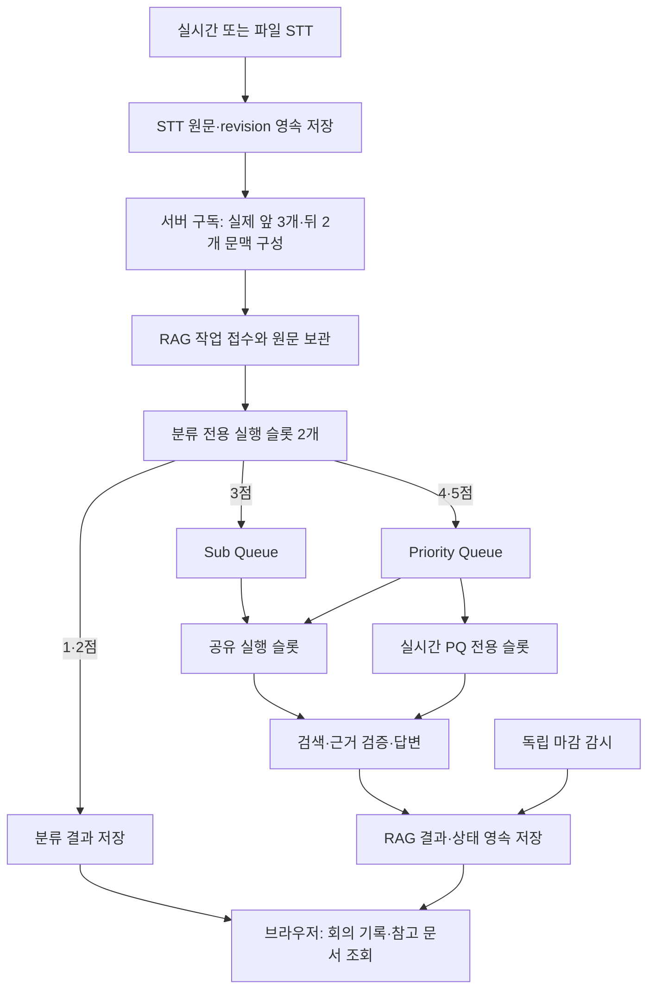

# 발화 분류와 Priority / Sub Queue 구현

2026-09-18 · 구현·설치 서비스 적용·자동 테스트 542개·실제 모델 합성 7개 사례 검증 완료

안정된 STT 발화를 서버에서 보관한 뒤 분류 모델로 평가한다. 1·2점은 원문과 분류를 저장하고, 3점은 Sub Queue(SQ), 4·5점은 Priority Queue(PQ)에서 근거 검색과 답변을 수행한다. 브라우저가 분석 작업의 소유자가 아니므로 탭을 닫아도 수락된 작업이 유지된다.

원래의 요구·의사결정·설계 그림은 [설계 문서](meeting-priority-design.md)에 있다. 이 문서는 현재 구현된 동작과 아직 구현하지 않은 범위를 구분한다.

## 1. 현재 처리 구조

- 입력은 `partial` 토큰 갱신이 아니라 안정된 발화다. 수동 교정은 revision을 유지한 채 RAG 입력에서 안정 발화로 정규화한다.
- STT의 원문 저장소가 영속 입력함 역할을 한다. 서버 구독과 전달 영수증을 함께 보관하며, 실패하거나 재시작한 경우 미전달 원문부터 재시도한다.
- `source_key`는 해당 발화, 실제 앞뒤 문맥, 문서 revision, 구독 세대를 반영한다. 별도 `source_generation`은 세션 snapshot의 단조 증가 번호이며 오래된 전달을 거절하는 데 사용한다. 다른 발화의 변경만으로 모든 기존 작업의 키가 바뀌지는 않는다.
- 원문이 그대로인 revision 갱신과 stable→final 승격은 처리 키를 유지한다. 발화별 의미 해시와 현재 처리 키를 외부 호출 전에 저장하며, 문장 A→B→A 또는 삭제 후 재삽입은 새 키를 받는다. 이전 버전의 전달 영수증도 이어받아 배포·재시작만으로 완료된 기록을 다시 분석하지 않는다.
- 파일은 한 회차에 최대 4개, 실시간은 최대 12개를 접수한다. RAG 용량 초과로 접수가 보류되면 STT 원문과 영수증을 유지한다. 오래된 발화를 버리는 브라우저의 8개 대기열 제한은 현재 자동 처리 경로에서 사용하지 않는다.
- 앞 문맥 최대 3개와 실제 도착한 뒤 문맥 최대 2개를 전달한다. 전송 전 문장을 1,500자에서 잘라 의미를 바꾸지 않는다. 분류기의 입력 예산을 넘으면 완전한 발화 단위로 제외하고 `context_omitted`를 기록한다. 불확실한 대상을 확인된 것으로 취급하지 않는다.
- 원문과 문맥이 수정되거나 발화가 철회되면 관련 작업을 갱신한다. 서버의 세대 검증과 브라우저 조회 연결부의 현재 source 검증으로 오래된 결과가 다시 붙는 것을 막는다.
- 완료된 세션에 변화가 없으면 상위 RAG로 주기적인 heartbeat를 보내지 않는다. 로컬 저장소에서 변경 여부만 검사한다.

## 2. 점수와 결과

| 점수 | 기준 | 예시 | 후속 처리 |
|---|---|---|---|
| 1 | 독립적인 의미가 없는 추임새 | “어”, “음” | 원문·분류 저장 |
| 2 | 일상 대화 또는 선택한 RAG의 업무 범위 밖 | 날씨 질문, 개인 프로젝트의 Docker 질문 | 원문·분류 저장 |
| 3 | 업무 범위 안의 주제 제시 | “저희 운영 로그 이야기해야 해요” | SQ에서 관련 자료 검토 |
| 4 | 업무 범위 안의 구체적 주장·설명·질문 | “로그는 45일 보관해요”, 운영 Docker 관리 질문 | PQ에서 검증·답변 |
| 5 | AI를 수신자로 명확히 지정한 업무 요청 | “AI야, 우리 운영서버 로그 보관일 알려줘” | PQ에서 우선 응답 |

점수는 발언자의 가치나 친밀도 점수가 아니다. 지금 선택한 RAG로 처리할 업무 관련성과 발화 행위를 뜻한다. 같은 Docker 질문도 개인 프로젝트 문맥이면 2점, 우리 서비스의 배포 문맥이면 4점이 된다. AI에게 요청해도 업무 범위 밖이면 2점이다.

범위가 불확실하면 점수를 억지로 2점으로 정하지 않고 분류 보류 상태를 기록한다. 제한된 시간 동안 후속 문맥을 기다린 뒤에도 판단되지 않으면 확인이 필요한 결과를 남긴다. 5점이라고 서버 변경이나 파일 삭제 권한이 생기지는 않는다. 지원하지 않는 명령은 `unsupported_action`으로 응답한다.

원문·점수·분류 이유·큐·현재 단계·마감·결과를 서버 작업에 저장한다. 검색 근거가 부족하면 `insufficient_evidence`, 낮은 점수면 검색 없이 `suppressed` 결과가 될 수 있다. 작업이 완료됐다는 것과 문서 근거가 있는 답변이 생성됐다는 것은 별도 상태다.

## 3. 큐와 마감

분류용 슬롯 2개, 실시간 PQ 전용 슬롯 1개, PQ/SQ 공유 슬롯 1개를 분리해 총 4개 작업으로 동시 실행을 제한한다. 파일에서 나온 PQ 작업도 PQ로 기록되지만 실시간 전용 슬롯은 차지하지 않는다. 같은 워크스페이스 안에서는 마감이 가까운 PQ 작업을 먼저 선택하며, 마감이 같으면 높은 점수를 우선한다. 워크스페이스 간에는 실제 실행 시간 사용량도 고려한다.

기본 응답 목표 N은 20초이며 분류 단계의 기본 제한시간은 8초다. 초기 실제 모델 검증에서 4초 제한으로 분류 실패가 확인되어 기본값을 조정했다. 실시간에서는 안정된 원문의 도착과 구독 시작을 기준으로 절대 마감을 정한다. 파일은 점진적으로 접수되는 시점부터 예산을 사용한다. 각 단계는 남은 예산을 확인하며, 시간 설정을 바꾸더라도 이미 접수한 작업의 마감은 유지한다.

| 모드 | 기본 진입 기준 | SQ 처리 |
|---|---|---|
| `NORMAL` | 마감 위험이 낮음 | 공유 슬롯에서 처리 가능 |
| `PRESSURED` | N의 50% 경과 | 다음 단계 실행을 제한하고 PQ 우선 |
| `PQ_ONLY` | N의 80% 경과 또는 예상 마감 실패 | SQ의 새 단계 실행 중단 |
| `RECOVERY` | 위험이 줄어든 뒤 기본 3초 관찰 | 안정화 확인 후 정상 처리 재개 |

마감 감시는 분류·검색·생성 작업과 별도로 실행된다. N을 넘긴 작업에는 지연 사실을 표시하며, 이를 답변 성공으로 집계하지 않는다. 시간 초과 뒤에도 지원되는 범위에서 제한된 재시도와 후속 처리를 이어갈 수 있다. 지연 표시를 남겼다고 N초 내에 완성 답변을 보장했다는 뜻은 아니다.

## 4. 관리자 사용법

1. RAG에서 문서를 색인하고 AI 연결을 활성화한 뒤, 해당 워크스페이스의 현재 공급자에 대한 전송 설정을 확인한다.
2. 실시간 또는 파일 STT 세션을 열고 회의 도우미에서 참고할 워크스페이스를 선택한다.
3. 관리자 계정에서 **관리자 · 분류와 응답 설정**을 연다. **응답 목표 N (초)**에 3~120초를 지정하고 필요하면 처리 강화·복구 비율과 단계별 제한시간을 조정한다.
4. **우리 RAG의 업무 범위**에 우리 서비스, 포함 주제, 제외 주제, 별칭을 기입한다. 예를 들어 Docker를 무조건 포함하기보다 “우리 서비스 운영 배포”를 포함하고 “개인 프로젝트”를 제외한다.
5. 분류 모델은 슈퍼관리자만 변경할 수 있다. 빈 값은 기존 기본 모델을 사용한다. 모델 이름을 지정했다고 저렴하거나 빠르다고 검증된 것은 아니므로 실제 호출 비용·지연·분류 품질을 별도로 확인한다.
6. **회의 검토 시작**을 누른다. 점수별 이력, PQ/SQ 대기 수, 근거 팝업, 마감 초과와 실패 상태를 확인한다. 실패한 작업에는 재시도를 요청할 수 있다.

탭을 닫아도 시작한 구독과 수락된 작업은 서버에서 계속된다. **검토 종료**는 새 분석과 아직 끝나지 않은 작업을 중단하며, 원문과 완료 결과는 보존한다. 다시 시작하면 구독 세대가 바뀌어 취소 전 영수증 때문에 새 작업이 누락되지 않는다. STT 세션 삭제는 원문과 해당 RAG 작업을 정리하는 별도 동작이다.

정책은 버전을 검사해 저장한다. 다른 관리자의 변경과 충돌하면 다시 불러와야 한다. 응답 목표 등 시간 설정은 새 작업에 적용하고, 업무 범위·분류 모델 변경은 해당 구독의 작업을 다시 판단할 수 있다. 이 경우에도 기존 마감을 뒤로 미루지 않는다.

## 5. 인증, 저장, API

구독 생성·조회·작업 조회·재시도와 직접 분석은 모든 역할에서 STT 세션 소유권을 검사한다. 구독 등록 시 실제 사용자의 인증을 RAG로 전달하고 RAG가 소유자를 저장한다. 이후 background 전달은 loopback 서비스 자격증명과 공유 access DB의 별도 브리지 비밀값을 함께 검증한 뒤 이미 등록된 구독으로 제한한다. 설치 관리자 키와 내부 구독 표시만으로는 이 경로를 사용할 수 없다. 사용자 Cookie나 Bearer 원문은 새 구독 저장소에 보관하지 않는다. 프록시와 HTTP 리다이렉트를 통한 자격증명 전달도 차단한다.

STT는 구독·원문 도착 시각·전달 영수증·삭제 tombstone을 저장한다. RAG schema 6은 정책·구독·작업과 검색 checkpoint를 보관한다. 삭제 전달에 실패하면 tombstone을 유지해 재시도한다. 워크스페이스 A→B→A 전환에서 현재 구독을 이전 cleanup 작업이 취소하지 않도록 방어한다. 이전 워크스페이스 자체가 이미 삭제됐다면 인증된 서버 cleanup은 완료로 처리하여 현재 워크스페이스 접수가 막히지 않게 한다.

| API | 용도 |
|---|---|
| `PUT /api/stt/meeting/sessions/{sid}/subscription` | 선택한 workspace/revision으로 시작·종료 |
| `GET /api/stt/meeting/sessions/{sid}/subscription` | 서버에 저장된 구독 확인 |
| `GET /api/stt/meeting/sessions/{sid}/jobs` | 점수·큐·결과와 커서 기반 이력 조회 |
| `POST /api/stt/meeting/sessions/{sid}/jobs/{jid}/retry` | 소유한 실패 작업 재시도 |
| `GET/PUT /api/rag/workspaces/{wid}/meeting/policy` | 정책 조회·관리자 변경 |
| `POST /api/rag/workspaces/{wid}/meeting/jobs` | 영속 작업 접수 |
| `POST /api/rag/workspaces/{wid}/meeting/sessions/{sid}/sync` | 현재 발화 집합·세대 반영 |

기존 동기 `/meeting/analyze` API는 호환성을 위해 유지한다. 현재 자동 입력의 실행 큐는 서버 구독 경로다. 원문·문맥 입력과 HTTP 크기에는 상한이 있고, 작업 조회는 기본 15개씩 페이지를 나눈다.

## 6. 자동 검증

2026-09-18 확인 기록:

| 검증 | 결과 |
|---|---|
| RAG Python 테스트 | 284개 통과 |
| STT Python 테스트 | 207개 통과 |
| 프런트엔드 테스트 | 51개 통과 |
| 프런트엔드 프로덕션 빌드 | 통과 |

회귀 범위에는 점수 분류 계약, PQ/SQ 분리와 압력 모드, 독립 마감 표시, 재시도·재시작 복구, 수정·삭제·오래된 결과 차단, 세션 소유권, 서비스 내부 요청 위조 차단, 재구독, 파일 접수 제한, 페이지 조회가 포함된다. 실제 HTTP를 사용한 STT↔RAG 통합 테스트는 별도 Python 프로세스를 연결하되 음성·임베딩·LLM은 합성 구현으로 대체한다. 따라서 이 숫자는 실제 공급자의 지연시간이나 실제 회의에서의 분류 정확도를 측정한 결과가 아니다.

### 설치 서비스와 실제 모델 검증 기록

2026-09-18 21:57 PDT에 최종 검증했다. 설치된 STT(8765)와 RAG(8766)를 백업 후 갱신했고, 배포한 핵심 소스의 해시 일치와 RAG DB schema 6을 확인했다. 기존 STT 엔진은 준비 상태이며 활성 녹음은 없다. 실제 음성을 새로 녹음하는 검사는 이번 검증에 포함하지 않았다.

현재 설정의 `gpt-5.6-luna`를 분류와 답변에 사용했다. 분류에만 `reasoning_effort=low`를 적용하고 답변의 기존 `high` 설정은 유지했다. 임베딩은 `intfloat/multilingual-e5-small`이다. 전역 AI 설정 변경 없이 임시 합성 문서와 워크스페이스로 검사했고, 종료 후 임시 워크스페이스 삭제를 DB에서도 확인했다. 분류 제한은 8초, N은 20초였다.

| 실제 모델 합성 사례 | 점수 | 큐 | 결과 | 접수부터 완료까지 |
|---|---|---|---|---|
| “어” | 1 | 없음 | 원문·분류 저장 | 3.910초 |
| “밖에 비 와요?” | 2 | 없음 | 원문·분류 저장 | 3.485초 |
| 운영 로그 주제 제시 | 3 | SQ | 근거 응답 | 14.489초 |
| 운영 로그 45일 주장 | 4 | PQ | 근거 비교 응답 | 10.861초 |
| 우리 서비스 문맥의 Docker 질문 | 4 | PQ | 근거 응답 | 12.520초 |
| 개인 프로젝트 문맥의 같은 Docker 질문 | 2 | 없음 | 원문·분류 저장 | 3.460초 |
| AI를 부른 로그 보관일 요청 | 5 | PQ | 근거 응답 | 10.092초 |

7개 모두 기대 점수·큐·상태를 충족했고 PQ 3개 모두 N 이내에 완료했다. 분류 호출은 3.317~5.399초였다. 이 수치는 짧은 합성 사례를 순차 실행한 관측값이며 실제 회의 정확도나 동시 부하의 p95/p99 성능 보장은 아니다.

[실제 호출 원본 보고서](meeting-priority-live-results.json) · [통합 검증 기록](meeting-priority-validation.json) · [설치된 화면 검증](meeting-priority-ui-validation.json). 화면에서는 자료 선택, 기본 N=20, 슈퍼관리자 모델 필드와 파일·실시간 도우미를 확인했으며 설정 저장·구독 시작은 하지 않았다.

초기 실패 기록은 [첫 실제 모델 검증 보고서](meeting-priority-live-initial-results.json)에 별도로 보존한다. `gpt-5.6-luna`, 분류 제한 4초로 진행한 첫 시도는 전체 성공이 아니었다. 개인 프로젝트 Docker 질문이 시간 제한으로 실패했으며, 1·2점 결과가 `unsupported_action`으로 표현되는 불일치도 있었다. 이후 분류 제한 기본값을 8초로 조정하고 낮은 점수 결과를 `suppressed`로 기록하도록 수정했다. 위 자동 테스트 결과와 최종 실제 호출 결과에는 이 수정 검증이 포함된다.

실행 스크립트는 [meeting_priority_smoke.py](../scripts/meeting_priority_smoke.py)다. 현재 설치된 AI 설정을 읽고 임시 합성 워크스페이스만 생성해 사용한다. 전역 AI 설정을 바꾸지 않으며, 사례 실패도 보고서에 남기고 임시 워크스페이스를 정리한다.

## 7. 명확한 한계와 남은 작업

- **N은 완성 답변의 절대 보장이 아니다.** 외부 공급자, CPU/GPU, 네트워크 지연을 포함한다. 독립 watchdog의 초과 표시와 실제 완료를 구분한다. 프로세스 자체가 멈추거나 내려가면 그동안 화면에 정시 알림을 전달할 수도 없다.
- **SQ의 최종 완료에는 부하 조건이 있다.** PQ 유입이 가용 용량을 계속 넘으면 SQ를 무한히 기다리게 할 수 있다. 현재는 영속 보관·접수 제한·실시간 용량 보호를 구현했으며, 무한 과부하에서 완료 시한을 보장하지 않는다. 용량 확장과 별도 운영 기준이 필요하다.
- **복구 단위는 단일 RAG 프로세스다.** SQLite와 기존 프로세스 소유 잠금에 기반한다. 다중 서버 분산 큐, 프로세스 간 공유 작업 lease, 고가용성 failover를 구현한 것은 아니다.
- **물리 호출을 선점하지 못한다.** 모델 호출·벡터 검색이 이미 시작됐다면 외부 연산을 즉시 중단한다고 가정하지 않는다. SQ는 단계 경계에서 멈추며, lease 검증은 오래된 결과의 반영을 막는다. 공유 하드웨어·공급자 제한 때문에 논리 슬롯 분리가 물리 성능 격리를 보장하지 않는다.
- **마감 위험 예측은 초기 고정 추정값을 사용한다.** 분류 3초·검색 3초·생성 2초를 기준으로 남은 시간을 비교한다. 모델별·장비별 p95/p99 통계에 기반한 적응형 예측과 자동 용량 조정은 아직 없다.
- **문맥은 제한된 실제 발화 창이다.** 장기 주제 상태·대상 cache, 의미가 비슷한 질문의 semantic coalescing, 혼합 발화의 절 단위 split은 구현하지 않았다. 원문 revision/문맥 fingerprint 중복 제어는 있으나 의미가 같은 다른 문장을 합치는 기능과는 다르다.
- **분류 모델의 비용·품질은 운영 검증 대상이다.** 기본 모델을 그대로 사용할 수 있고, 분류 전용 모델을 따로 선택할 수도 있다. 1·2점도 분류 호출은 필요하며, 앞뒤 문맥이나 교정이 달라지면 다시 분류할 수 있다.
- 낮은 점수 원문 보존을 구현했지만 친밀감·관계 점수 계산은 만들지 않았다. 보존된 원문에서 그러한 지표를 추론하는 정책과 평가 방법은 별도 작업이다.
- STT 인식 오류·문서 부족·LLM 추론 오류는 여전히 결과에 영향을 준다. 근거 인용과 출력 검증은 정확도 평가를 대체하지 않는다. 기존 마이크 세션 길이 등 STT 입력 제한도 별도로 적용된다.

## 구현 위치

- STT 구독과 전달: [subscriptions.py](../backend/app/modules/meeting/subscriptions.py)
- STT 원문·구독 저장소: [repository.py](../backend/app/modules/stt/repository.py)
- 분류 모델과 문맥 처리: [meeting_classifier.py](../rag/meetingbot_rag/meeting_classifier.py)
- 영속 작업과 스케줄러: [meeting_jobs.py](../rag/meetingbot_rag/meeting_jobs.py)
- 관리자 정책: [meeting_policy.py](../rag/meetingbot_rag/meeting_policy.py)
- 관리자 화면: [MeetingPolicyPanel.tsx](../frontend/src/features/meeting/MeetingPolicyPanel.tsx)
